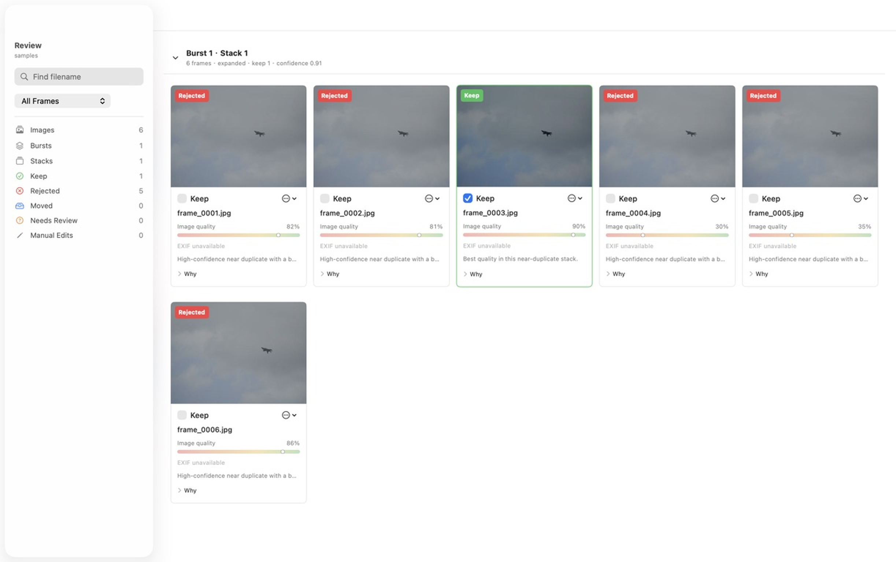

# Burst Frame Deduplicator

Cull burst photos without losing control.

Burst Frame Deduplicator scans a camera card or local photo folder, separates temporal bursts into posture-aware similarity stacks, and recommends which frames to keep, reject, or inspect. Decisions are preselected and remain fully editable. Source files are never changed during a scan.



## Highlights

- Scores whole-frame and subject sharpness, exposure, contrast, completeness, and out-of-frame risk.
- Preserves changes in posture, angle, or composition instead of treating an entire burst as one duplicate group.
- Refines likely keepers and close calls at higher resolution after a fast preview pass.
- Treats matching RAW/JPEG files and sidecars as one review asset.
- Uses Metal focus scoring and macOS Vision saliency when selected and available, with recorded CPU fallbacks.
- Includes a native SwiftUI macOS scan and review app, a headless CLI, a local review server, and a static WASM edition.
- Supports English and Simplified Chinese through editable JSON locale catalogs.

## Choose An Interface

| Interface | Best for | Scan engine | Review experience |
| --- | --- | --- | --- |
| Native macOS app | Normal interactive use | Shared Rust native backend through C FFI | Native SwiftUI grid, settings, and responsive image viewer |
| Headless CLI | Automation and large cards | Rust, Rayon, optional Metal/Vision | Artifacts only, or serve later |
| CLI `app` command | Terminal users who want immediate review | Rust, Rayon, optional Metal/Vision | Local browser UI |
| Static WASM app | GitHub Pages and installation-free use | Portable Rust scorer in-browser | Browser UI; JSON/script export and conditional local moves |

## Native macOS App

The native app targets Apple Silicon and requires macOS 14 or newer. It uses current SwiftUI controls, with macOS 26 Liquid Glass styling supplied by the system.

```bash
./scripts/build_macos_app.sh
open "target/macos/Burst Frame Deduplicator.app"
```

The Get Started view opens a source folder directly, resumes recent runs, and keeps result storage in Settings. Scans show weighted stage progress and become a native review workspace in the same window. `Command-N` launches another app process so multiple scans can run concurrently; collision-resistant run names keep their outputs separate.

RAW decoding uses Apple's Camera RAW/ImageIO support through the system `sips` tool first. ImageMagick is not bundled and is only an optional compatibility fallback for the CLI or formats the installed macOS release cannot decode.

Build a drag-to-Applications disk image for local testing:

```bash
./scripts/build_macos_dmg.sh
```

The default build is ad-hoc signed. Public distribution requires a Developer ID Application identity and notarization; see [Distribution](docs/USAGE.md#installing-or-distributing-the-macos-app).

## Command Line

Scan and immediately start the local review server:

```bash
cargo run --release -- app /Volumes/CARD/DCIM --open --acceleration metal --detector heuristic
```

Keep scan and review separate:

```bash
cargo run --release -- scan /Volumes/CARD/DCIM --acceleration metal --detector heuristic
cargo run --release -- serve --run runs/run_YYYYMMDD_HHMMSS --open
```

Default scoring uses a `1280px` long-edge preview and refines up to two candidates per stack at `2048px`. Long runs report discovery, analysis, grouping, refinement, ranking, writing, and export progress with current item counts.

## Static WASM App

```bash
cargo install wasm-pack --version 0.15.0 --locked
./web/wasm/build.sh
python3 -m http.server 4173 --directory web/dist
```

Open [http://127.0.0.1:4173](http://127.0.0.1:4173). Photos stay in the browser process. The decoder runs bounded parallel jobs, prefers scaled WebCodecs when the browser exposes it, and falls back to `createImageBitmap`; RAW-only assets use the bundled LibRaw-WASM worker.

The static edition can move and restore grouped files only when the folder was opened through a browser that provides read-write File System Access handles. Other browsers keep the workflow read-only and provide review JSON plus macOS/Linux and Windows scripts. It does not use Metal, Vision, Rayon, or native high-resolution refinement.

The GitHub Pages workflow builds the same static directory.

## Prerequisites

<details>
<summary>Build prerequisites and setup commands</summary>

| Requirement | macOS native | Linux/Windows CLI | Static WASM build |
| --- | --- | --- | --- |
| Rust/Cargo | Required | Required | Required |
| Swift 6 / Apple Command Line Tools | Required | Not required | Not required |
| ImageMagick | Optional compatibility fallback | Recommended for RAW | Not used |
| Git LFS | Benchmark fixture only | Benchmark fixture only | Benchmark fixture only |
| `wasm-pack` | Optional | Optional | Required |
| Modern browser | Optional local review | Optional local review | Required |

macOS setup:

```bash
xcode-select --install
brew install git-lfs
git lfs install
rustup toolchain install stable
```

Install ImageMagick only when a required format is not handled by the system Camera RAW stack:

```bash
brew install imagemagick
```

</details>

## Platform Support

Legend: ✅ supported · 🟡 partial or browser-dependent · 🧭 planned · — unavailable/not applicable

| Feature / backend | macOS Apple Silicon | Linux CPU | Linux NVIDIA | Windows CPU |
| --- | :---: | :---: | :---: | :---: |
| Headless CLI | ✅ | ✅ | ✅ | ✅ |
| Native GUI | ✅ SwiftUI | 🧭 | 🧭 | 🧭 |
| macOS 26 Liquid Glass controls | ✅ | — | — | — |
| Static WASM scan/review | ✅ | ✅ | ✅ | ✅ |
| JPEG/PNG/TIFF/WebP decode | ✅ | ✅ | ✅ | ✅ |
| RAW via Apple Camera RAW / `sips` | ✅ | — | — | — |
| RAW via ImageMagick fallback | 🟡 optional | ✅ | ✅ | ✅ |
| Browser RAW via LibRaw-WASM | ✅ | ✅ | ✅ | ✅ |
| Confirmed move + restore | ✅ | 🟡 browser | 🟡 browser | 🟡 browser |
| CPU/Rayon scoring | ✅ | ✅ | ✅ | ✅ |
| Metal focus scoring | ✅ | — | — | — |
| macOS Vision detector | ✅ | — | — | — |
| CUDA / TensorRT | — | — | 🧭 | 🧭 |
| OpenCL on Apple Silicon | — deprecated/limited | — | — | — |
| OpenVINO | — | 🧭 | 🧭 | 🧭 |
| English / Simplified Chinese | ✅ | ✅ | ✅ | ✅ |

Requested and selected backends, capabilities, and fallback notes are recorded in every `manifest.json`.

## Locale Configuration

User-facing strings live in [`locales/en.json`](locales/en.json) and [`locales/zh-CN.json`](locales/zh-CN.json), outside Rust and Swift source. The app bundle and static build copy these files as resources. For development or custom wording, point native components at another synchronized locale directory:

```bash
BURST_DEDUP_LOCALES_DIR=/path/to/locales ./target/release/burst-frame-deduplicator serve --run runs/example
```

## Safety

Scanning is read-only for source photos. A reject move is a separate confirmed action: it copies every file in a grouped asset, verifies copied sizes, and only then removes originals. The default destination is `moved_rejects/` inside the run directory; the user may choose another non-temporary local folder outside the source card. A durable move journal enables restore. The app exposes no permanent-delete control.

## Benchmarks

The Git LFS fixture contains 120 metadata-stripped original-resolution aircraft/sky frames. It includes reviewed must-link, cannot-link, and posture-coverage labels.

```bash
git lfs pull
python3 benchmark/run_benchmarks.py
npm install --prefix benchmark
python3 benchmark/run_frontend_benchmarks.py
```

See [accuracy/backend results](benchmark/results/latest.md) and [CLI/SwiftUI/WASM path results](benchmark/results/frontend-latest.md).

Detailed workflows are in [docs/USAGE.md](docs/USAGE.md). Architecture, FFI, acceleration, and timing details are in [docs/TECHNICAL.md](docs/TECHNICAL.md).
