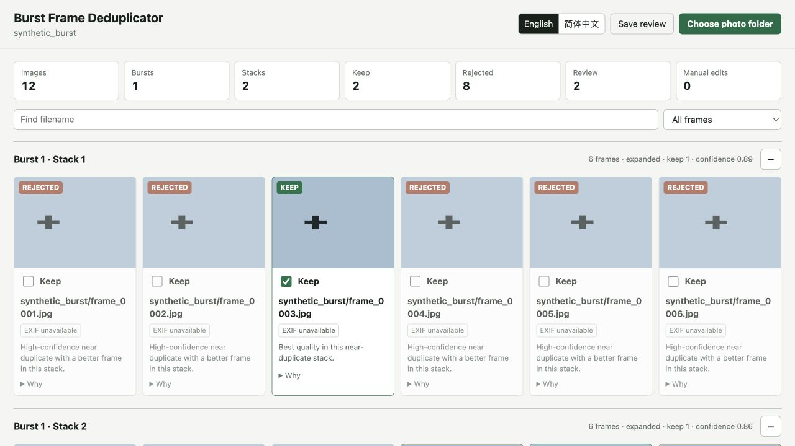
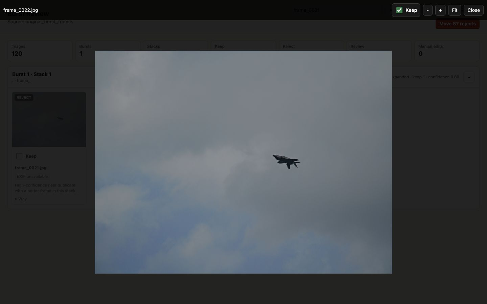

# Usage Guide

Burst Frame Deduplicator helps you review burst sequences without turning the process into a fully automatic delete operation. It scans a folder or mounted card, divides each temporal burst into subject-aware near-duplicate stacks, pre-fills keep/reject suggestions, and lets you override every decision.


## Before You Start

Install the normal prerequisites:

```bash
xcode-select --install
brew install imagemagick git-lfs
git lfs install
```

Make sure Rust is available:

```bash
rustc --version
cargo --version
```

For the benchmark example in this guide, also fetch Git LFS assets:

```bash
git lfs pull
```

## Recommended Workflow

Launch the native desktop application when you do not want to use a terminal:

```bash
./scripts/build_macos_app.sh
open "target/macos/Burst Frame Deduplicator.app"
```

Choose the photo folder, optionally choose a run folder, and start the scan. If the run folder is left blank, the app creates a timestamped folder under `~/Pictures/Burst Frame Deduplicator Runs`. The window shows the active stage, current file, item count, and weighted overall progress. When scanning finishes, the same window becomes a native SwiftUI review workspace; it does not open a browser.

Change the app language in **Settings > General**. The review state remains intact. The macOS 26 build uses the system Liquid Glass treatment for navigation and primary commands; earlier supported macOS versions retain native system controls.

For development, the Swift package can also be built directly after the Rust dynamic library exists:

```bash
cargo build --release --lib
swift build --package-path macos/BurstFrameDeduplicatorApp
```

## Command-Line Workflow

Use `app` for the smoothest workflow. It scans first, then starts the review page:

```bash
cargo run --release -- app /Volumes/CARD/DCIM --open --acceleration metal --detector heuristic
```

Replace `/Volumes/CARD/DCIM` with the mounted SD card folder or any photo folder.

The app writes a timestamped run directory under `runs/`. That directory contains the review manifest, thumbnails, CSV exports, and move reports.

The command line reports each long-running stage with overall percentage, item progress, and the current file. Redirect standard error if progress should go to a separate log:

```bash
cargo run --release -- scan /Volumes/CARD/DCIM 2> scan-progress.log
```

## Static Browser Edition

Build the browser-only application:

```bash
cargo install wasm-pack --version 0.15.0 --locked
./web/wasm/build.sh
python3 -m http.server 4173 --directory web/dist
```

Open `http://127.0.0.1:4173` and select a folder. The page reports the current stage, frame, and overall percentage while it decodes and scores previews; `Cancel` stops the run and releases partial previews. Everything runs locally in the browser. Browser formats use built-in decoding; RAW-only assets use the bundled LibRaw-WASM worker. The Rust WASM module performs subject scoring, burst grouping, posture-aware stack separation, and recommendation ranking.

The static edition supports English and Simplified Chinese, preselected decisions, filtering, stack collapse/expand, RAW EXIF supplied by LibRaw, full-image preview, arrow navigation, zoom/pan, review JSON export, and generated move scripts.



When a Chromium-style browser supplies read-write File System Access handles, `Save review` can copy, size-check, and move grouped files to a selected local folder, then restore them during the same browser session. A normal folder upload exposes read-only handles instead; in that case, direct move is disabled and the modal provides review JSON plus macOS/Linux and Windows scripts.

Browser-only analysis is not quality-equivalent to the native pipeline. It has no native EXIF/filesystem metadata fallback, Rayon, Metal, Vision saliency, or second high-resolution refinement pass. RAW uses LibRaw-WASM's bounded preview decode, and browser decoder behavior varies by format. On the included 120-frame aircraft fixture, the current browser path reaches `95.5%` reviewed pair accuracy and `100%` posture-phase coverage, while the native balanced and best-quality paths reach `100%` on both labels. Use native **Best Quality** for distant aircraft, birds, or other small subjects.

The repository’s Pages workflow deploys `web/dist` automatically after GitHub Pages is configured with **GitHub Actions** as its source.

## Separate Scan And Review

If you prefer to scan now and review later:

```bash
cargo run --release -- scan /Volumes/CARD/DCIM --acceleration metal --detector heuristic
```

Then serve the review UI for the run directory printed by the scan:

```bash
cargo run --release -- serve --run runs/run_YYYYMMDD_HHMMSS --open
```

## Try The Included Benchmark

The repo includes a sanitized original-resolution burst fixture under `benchmark/assets/original_burst_frames.zip`. It contains aircraft-against-sky frames with metadata stripped.

Run the benchmark:

```bash
python3 benchmark/run_benchmarks.py
```

Compare the headless CLI, native Swift FFI, and static browser/WASM paths:

```bash
npm install --prefix benchmark
python3 benchmark/run_frontend_benchmarks.py
```

Open one of the benchmark review runs:

```bash
cargo run --release -- serve --run benchmark/runs/metal_heuristic --open
```

The benchmark output is safe to use as a practice review because the raw benchmark run directory is ignored by Git.

## Reading The Review Page

Each card represents one asset. A RAW+JPEG pair with the same basename is treated as one asset, so the decision applies to both files.

- Checked `Keep`: this frame is selected to keep.
- Unchecked `Keep`: this frame is currently rejected.
- Indeterminate `Keep`: the scanner marked it as a close call needing review.
- `Why`: shows stack ranking, subject/whole-frame sharpness, visual distance, duplicate confidence, completeness, exposure, detector notes, and whether high-resolution refinement was used.
- EXIF chips: show compact metadata such as ISO, aperture, shutter speed, focal length, and 35mm-equivalent focal length when available.
- Highlighted EXIF chips: this field differs inside the same stack, which can explain why one frame is sharper, cleaner, or more motion-blurred than another.

Stacks are sorted with expanded stacks first. A stack collapses automatically when all frames inside it are kept, and you can manually collapse or expand it with the button on the right side of the header. Headers show both the temporal burst and stack numbers.

The compact `文/A` menu switches between English and Simplified Chinese without losing review decisions. In the native app, language is kept in the separate Settings window.

## Inspecting An Image

Click a thumbnail to open the full-resolution viewer.



In the viewer:

- Use the `Keep` checkbox in the top bar to change the decision for the current image.
- Use left/right arrow keys to move within the current near-duplicate stack.
- Use `+`, `-`, and `Fit` to zoom.
- Drag the image to pan after zooming.
- Press `Esc` or click `Close` to leave the viewer.

The native app loads normal compressed formats from the original path on demand. For RAW-only assets, Rust writes a high-quality JPEG to `native_previews/` under the run directory and reuses that cached file when the image is opened again.

The local browser review first tries the bundled LibRaw-WASM decoder for RAW-only images. Its decoded blob cache has a bounded memory budget, and the local server can fall back to generating a JPEG preview. The static WASM edition uses the same local LibRaw worker but has no native fallback.

If the source path is no longer available, for example because the SD card was ejected, the viewer shows an error instead of silently changing the decision. Already generated thumbnails and review decisions remain usable; a moved image can also be previewed from its recorded destination.

## Saving Decisions

Checkbox changes are saved to `review_state.json` as you make them. The native app and local review UI rewrite exports after each persisted decision. The CLI can regenerate them explicitly:

```bash
cargo run --release -- export --run runs/run_YYYYMMDD_HHMMSS
```

`Save review` in the local web interface opens a summary modal with keep/reject/review/moved counts, operating-system-specific move scripts, review JSON export, and confirmed move/restore actions. Generated artifacts include:

- `keepers.csv`
- `rejects.csv`
- `review.csv`
- `all_assets.csv`
- `bursts.csv`
- `clusters.csv`
- `move_rejects.sh`

These files live inside the run directory.

## Moving Rejects

`Move rejects` is intentionally a separate confirmed operation. The default destination is inside the run folder, and the native app or local review page can use another non-temporary local folder outside the source card.

When confirmed, the app:

1. Preflights every RAW, JPEG, sidecar, source path, and destination path in an asset group.
2. Copies the complete group and verifies every byte count.
3. Removes originals only after the complete group passes verification.
4. Records original and destination paths in `move_state.json` and writes a move report.

Moved cards use a distinct **Moved** status. `Restore moved` returns complete asset groups to their recorded original paths after checking that the source card/folder is connected and no same-name file now occupies a path. The app never recreates an unavailable mounted volume.

Do not remove a run directory that still contains moved rejects or an active restore journal. **Settings > Storage** calculates previous-run usage and warns again before removing such data. Custom move destinations remain outside the cache, but removing their journal prevents one-click restore.

## Best-Quality Scan

For small or distant subjects, choose **Best Quality (Recommended)** under **Settings > Analysis**, or use the equivalent CLI options:

```bash
cargo run --release -- scan /path/to/photos \
  --preview-size 2048 \
  --refine-size 4096 \
  --refine-candidates-per-cluster 4 \
  --max-duplicate-distance 0.18 \
  --min-duplicate-confidence 0.60 \
  --acceleration metal \
  --detector vision
```

This preset makes posture grouping more conservative and gives tiny or uncertain subjects a higher-resolution localization pass. The benchmark fixture retained `100%` reviewed pair accuracy and posture coverage at `3.29` assets/sec with about `1.89 GB` peak RSS. Use Balanced when turnaround matters more than the additional small-subject margin.

## Useful Scan Options

```bash
cargo run --release -- scan /path/to/photos \
  --preview-size 1280 \
  --refine-size 2048 \
  --refine-candidates-per-cluster 2 \
  --max-duplicate-distance 0.20 \
  --min-duplicate-confidence 0.52 \
  --acceleration metal \
  --detector heuristic
```

Common options:

- `--preview-size`: long edge for the fast first pass.
- `--refine-size`: long edge for high-resolution refinement of likely keepers and close calls.
- `--refine-candidates-per-cluster`: strict maximum candidates per near-duplicate stack to refine.
- `--max-duplicate-distance`: lower values preserve more posture/angle variation as separate stacks.
- `--min-duplicate-confidence`: minimum evidence required for an automatic reject; lower-confidence frames remain review items.
- `--no-refine`: skip high-resolution refinement for faster but less careful scans.
- `--acceleration cpu|metal|auto`: choose the scoring backend preference.
- `--detector heuristic|vision|off|auto`: choose the local subject detector.
- `--keepers-per-cluster N`: force a fixed keep count for every near-duplicate stack.
- `--cull-singletons`: allow unique non-burst images to be rejected when they score poorly.
- `--workers N`: set worker count for parallel scoring.

## What Is Heavy

The scan is the heavy phase. It walks the folder, decodes images, extracts EXIF, scores quality, runs detector/refinement work, generates thumbnails, clusters bursts, and writes artifacts.

The WebUI is light by default. It loads the manifest and thumbnails first. Full-resolution images and RAW previews are loaded only when you open an image.

The original source folder must be available throughout discovery, decode, scoring, and a move or restore operation. It may be disconnected while reviewing cached thumbnails and decisions. If a move is requested while the source is unavailable, the app leaves all files untouched and asks you to reconnect the source.

## Customizing Language Files

English and Simplified Chinese strings are stored in `locales/en.json` and `locales/zh-CN.json`. Keep both key sets synchronized when editing them. Native development builds and the local server can load another directory:

```bash
BURST_DEDUP_LOCALES_DIR=/path/to/locales ./target/release/burst-frame-deduplicator serve --run runs/example
```

The packaged macOS app and static web build copy the repository catalogs into their resources.

## Troubleshooting

If RAW files do not decode during scan, install ImageMagick:

```bash
brew install imagemagick
```

If benchmark assets are missing:

```bash
git lfs pull
```

If the review page opens but full-resolution previews fail, confirm the original source folder or SD card is still mounted.

If Metal is requested but unavailable, the app falls back to CPU/Rayon scoring and records the fallback in the manifest.
