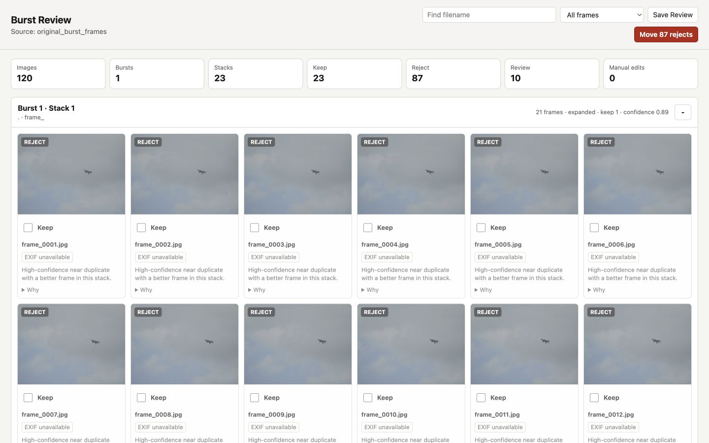

# Usage Guide

Burst Frame Deduplicator helps you review burst sequences without turning the process into a fully automatic delete operation. It scans a folder or mounted card, divides each temporal burst into subject-aware near-duplicate stacks, pre-fills keep/reject suggestions, and gives you a local review page where you can override every decision.



## Before You Start

Install the normal prerequisites:

```bash
xcode-select --install
brew install imagemagick git-lfs
git lfs install
```

Make sure Rust is available:

```bash
rustc --version
cargo --version
```

For the benchmark example in this guide, also fetch Git LFS assets:

```bash
git lfs pull
```

## Recommended Workflow

Launch the native desktop application when you do not want to use a terminal:

```bash
cargo run --release --features gui -- gui
```

Choose the photo folder, optionally choose a run folder, and start the scan. If the run folder is left blank, the app creates a timestamped folder under `~/Pictures/Burst Frame Deduplicator Runs`. The window shows the active stage, current file, item count, and weighted overall progress. It opens the local review page when the scan finishes.

Use the `English` / `简体中文` control to change the desktop language. The selected language is passed to the review page, where it can also be changed from the toolbar.

To build a normal macOS application bundle:

```bash
./scripts/build_macos_app.sh
open "target/macos/Burst Frame Deduplicator.app"
```

## Command-Line Workflow

Use `app` for the smoothest workflow. It scans first, then starts the review page:

```bash
cargo run --release -- app /Volumes/CARD/DCIM --open --acceleration metal --detector heuristic
```

Replace `/Volumes/CARD/DCIM` with the mounted SD card folder or any photo folder.

The app writes a timestamped run directory under `runs/`. That directory contains the review manifest, thumbnails, CSV exports, and move reports.

The command line reports each long-running stage with overall percentage, item progress, and the current file. Redirect standard error if progress should go to a separate log:

```bash
cargo run --release -- scan /Volumes/CARD/DCIM 2> scan-progress.log
```

## Static Browser Edition

Build the browser-only application:

```bash
cargo install wasm-pack --version 0.15.0 --locked
./web/wasm/build.sh
python3 -m http.server 4173 --directory web/dist
```

Open `http://127.0.0.1:4173` and select a folder. The page reports the current stage, frame, and overall percentage while it decodes and scores previews; `Cancel` stops the run and releases partial previews. Everything runs locally in the browser. Browser formats use built-in decoding; RAW-only assets use the bundled LibRaw-WASM worker. The Rust WASM module performs subject scoring, burst grouping, posture-aware stack separation, and recommendation ranking.

The static edition supports English and Simplified Chinese, preselected decisions, filtering, stack collapse/expand, RAW EXIF supplied by LibRaw, full-image preview, arrow navigation, zoom/pan, and JSON review export.


Browser security does not allow the same verified source-file move operation as the native application. The static edition never modifies selected files; `Save review` downloads a JSON decision list instead. It also uses CPU/WASM preview scoring and does not provide Metal/Vision or native high-resolution refinement.

The repository’s Pages workflow deploys `web/dist` automatically after GitHub Pages is configured with **GitHub Actions** as its source.

## Separate Scan And Review

If you prefer to scan now and review later:

```bash
cargo run --release -- scan /Volumes/CARD/DCIM --acceleration metal --detector heuristic
```

Then serve the review UI for the run directory printed by the scan:

```bash
cargo run --release -- serve --run runs/run_YYYYMMDD_HHMMSS --open
```

## Try The Included Benchmark

The repo includes a sanitized original-resolution burst fixture under `benchmark/assets/original_burst_frames.zip`. It contains aircraft-against-sky frames with metadata stripped.

Run the benchmark:

```bash
python3 benchmark/run_benchmarks.py
```

Open one of the benchmark review runs:

```bash
cargo run --release -- serve --run benchmark/runs/metal_heuristic --open
```

The benchmark output is safe to use as a practice review because the raw benchmark run directory is ignored by Git.

## Reading The Review Page

Each card represents one asset. A RAW+JPEG pair with the same basename is treated as one asset, so the decision applies to both files.

- Checked `Keep`: this frame is selected to keep.
- Unchecked `Keep`: this frame is currently rejected.
- Indeterminate `Keep`: the scanner marked it as a close call needing review.
- `Why`: shows stack ranking, subject/whole-frame sharpness, visual distance, duplicate confidence, completeness, exposure, detector notes, and whether high-resolution refinement was used.
- EXIF chips: show compact metadata such as ISO, aperture, shutter speed, focal length, and 35mm-equivalent focal length when available.
- Highlighted EXIF chips: this field differs inside the same stack, which can explain why one frame is sharper, cleaner, or more motion-blurred than another.

Stacks are sorted with expanded stacks first. A stack collapses automatically when all frames inside it are kept, and you can manually collapse or expand it with the button on the right side of the header. Headers show both the temporal burst and stack numbers.

Use the language selector in the toolbar to switch between English and Simplified Chinese without losing review decisions.

## Inspecting An Image

Click a thumbnail to open the full-resolution viewer.


In the viewer:

- Use the `Keep` checkbox in the top bar to change the decision for the current image.
- Use left/right arrow keys to move through the full temporal burst, including adjacent stacks.
- Use `+`, `-`, and `Fit` to zoom.
- Drag the image to pan after zooming.
- Press `Esc` or click `Close` to leave the viewer.

For normal browser image formats, the viewer loads the source file on demand. For RAW-only images, the browser first tries the bundled local LibRaw-WASM decoder. The decoded preview is cached in the page with a bounded memory budget, so reopening the same RAW image avoids another WASM decode while it remains in cache. If browser-side RAW decoding fails, the server falls back to generating a local JPEG preview.

If the source path is no longer available, for example because the SD card was ejected, the viewer shows an error instead of silently changing the decision.

## Saving Decisions

Checkbox changes are saved to `review_state.json` as you make them. Use `Save Review` to rewrite the CSV exports and move script after review changes:

- `keepers.csv`
- `rejects.csv`
- `review.csv`
- `all_assets.csv`
- `bursts.csv`
- `clusters.csv`
- `move_rejects.sh`

These files live inside the run directory.

## Moving Rejects

`Move rejects` is intentionally a separate confirmed operation. It asks for confirmation before moving anything.

When confirmed, the app:

1. Copies each rejected source file into `moved_rejects/` under the run directory.
2. Verifies copied file size.
3. Removes the original source file only after the copy check passes.
4. Writes a move report under the run directory.

The destination is local to the run directory, not `/tmp`, so ordinary temporary-file cleaners should not remove it. Review `moved_rejects/` yourself before deleting it permanently.

## Useful Scan Options

```bash
cargo run --release -- scan /path/to/photos \
  --preview-size 1280 \
  --refine-size 2048 \
  --refine-candidates-per-cluster 2 \
  --max-duplicate-distance 0.20 \
  --min-duplicate-confidence 0.52 \
  --acceleration metal \
  --detector heuristic
```

Common options:

- `--preview-size`: long edge for the fast first pass.
- `--refine-size`: long edge for high-resolution refinement of likely keepers and close calls.
- `--refine-candidates-per-cluster`: strict maximum candidates per near-duplicate stack to refine.
- `--max-duplicate-distance`: lower values preserve more posture/angle variation as separate stacks.
- `--min-duplicate-confidence`: minimum evidence required for an automatic reject; lower-confidence frames remain review items.
- `--no-refine`: skip high-resolution refinement for faster but less careful scans.
- `--acceleration cpu|metal|auto`: choose the scoring backend preference.
- `--detector heuristic|vision|off|auto`: choose the local subject detector.
- `--keepers-per-cluster N`: force a fixed keep count for every near-duplicate stack.
- `--cull-singletons`: allow unique non-burst images to be rejected when they score poorly.
- `--workers N`: set worker count for parallel scoring.

## What Is Heavy

The scan is the heavy phase. It walks the folder, decodes images, extracts EXIF, scores quality, runs detector/refinement work, generates thumbnails, clusters bursts, and writes artifacts.

The WebUI is light by default. It loads the manifest and thumbnails first. Full-resolution images and RAW previews are loaded only when you open an image.

## Troubleshooting

If RAW files do not decode during scan, install ImageMagick:

```bash
brew install imagemagick
```

If benchmark assets are missing:

```bash
git lfs pull
```

If the review page opens but full-resolution previews fail, confirm the original source folder or SD card is still mounted.

If Metal is requested but unavailable, the app falls back to CPU/Rayon scoring and records the fallback in the manifest.
