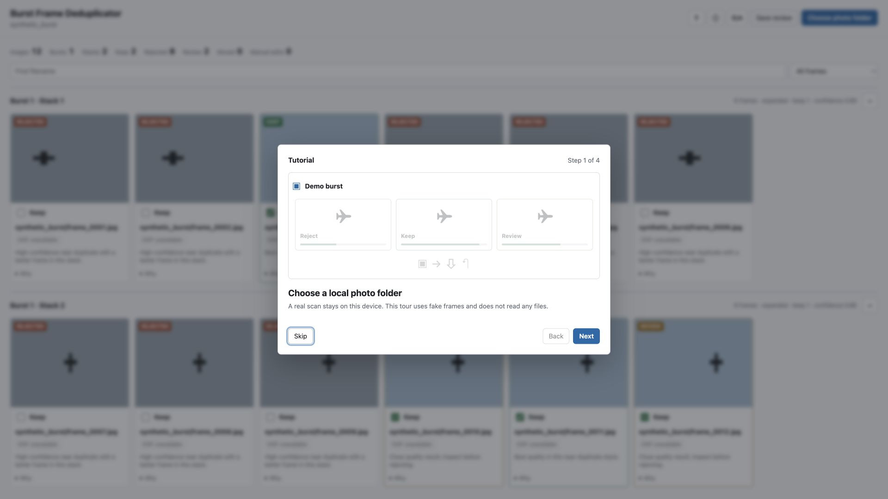
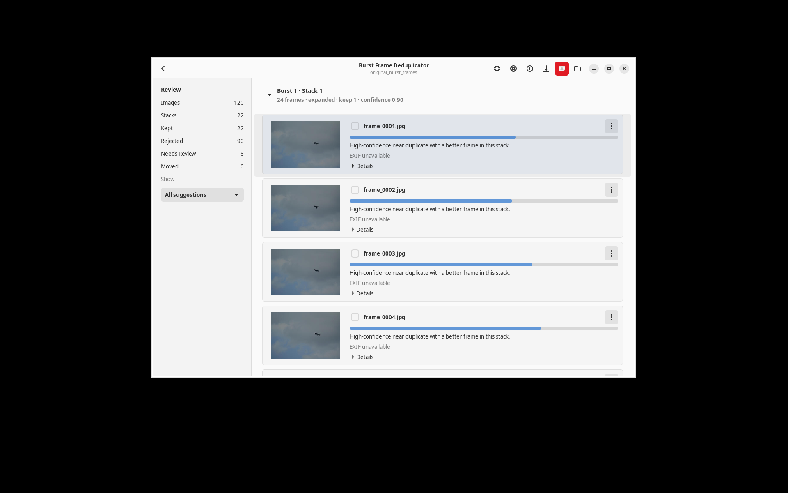
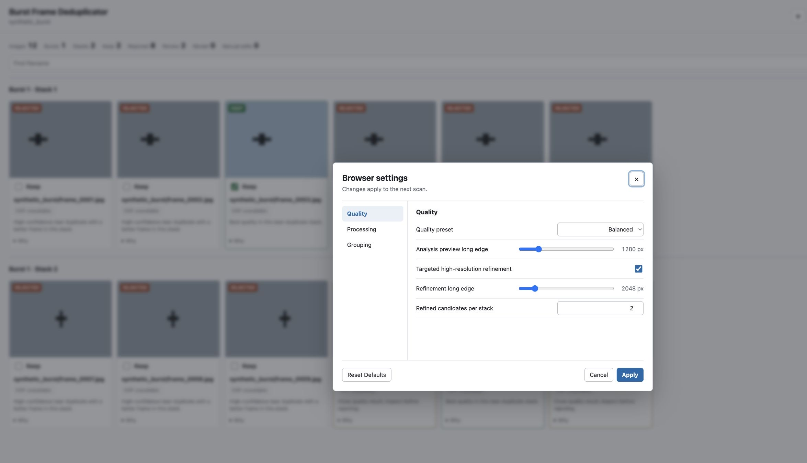
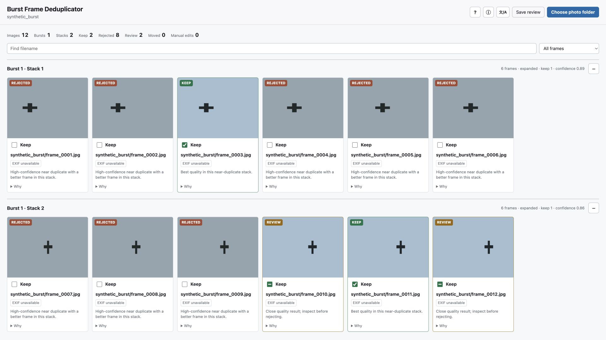
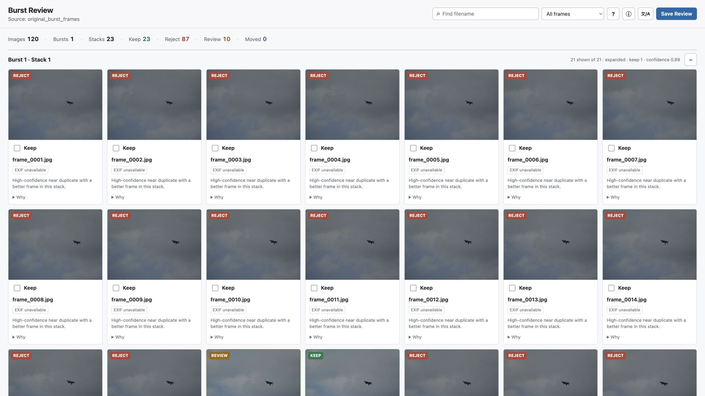
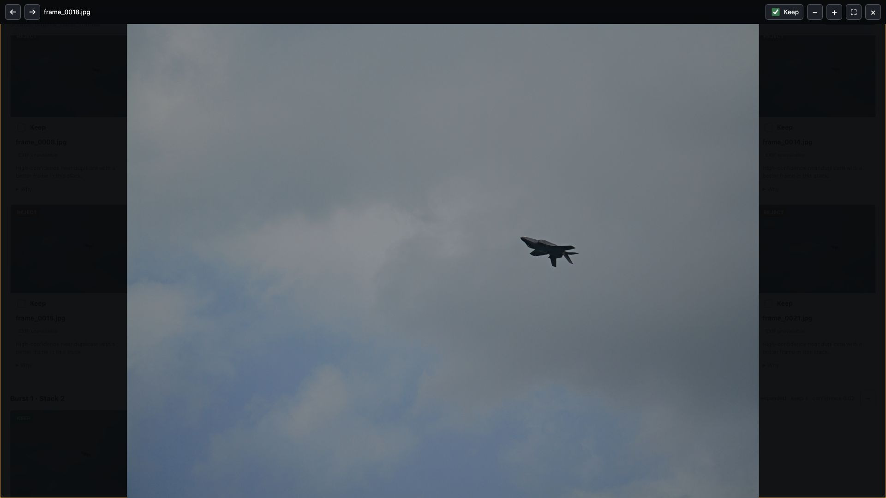

# Usage Guide

Burst Frame Deduplicator helps you review burst sequences without turning the process into a fully automatic delete operation. It scans a folder or mounted card, divides each temporal burst into subject-aware near-duplicate stacks, pre-fills keep/reject suggestions, and lets you override every decision.


## Before You Start

<details>
<summary>Build prerequisites and benchmark assets</summary>

Install the normal prerequisites:

```bash
xcode-select --install
brew install git-lfs
git lfs install
```

On Ubuntu 24.04, install the native Linux app and RAW-preview prerequisites:

```bash
sudo apt-get update
sudo apt-get install libgtk-4-dev libadwaita-1-dev libgdk-pixbuf-2.0-dev \
  libraw23t64 imagemagick
```

Make sure Rust is available:

```bash
rustc --version
cargo --version
```

For the benchmark example in this guide, also fetch Git LFS assets:

```bash
git lfs pull
```

</details>

## First-Launch Tour And Diagnostics

The native app and both browser interfaces show a four-step interactive tour on first launch. The frames are synthetic: opening, advancing, or skipping the tour does not scan a folder or change a decision. **Skip Tutorial** is available on every step.

Open the tour again from **Help > Show Tutorial** in the native app or the `?` button in either website. The native **About** window reports build commit/toolchains and local OS, memory, GPU, and Metal details. Website **About** dialogs link to the source repository and add browser diagnostics; the local CLI review also reports its selected acceleration, detector, and RAW decoder, while the static edition reports its WASM build toolchain.

Completing or skipping the tour is persistent. The macOS app stores a structured record in its application preferences; the Linux app stores the same outcome/schema/timestamp fields under `$XDG_CONFIG_HOME/burst-frame-deduplicator/config.json` (normally `~/.config/burst-frame-deduplicator/config.json`). The local CLI review stores the record in browser local storage and a same-host cookie, so changing the local server port does not replay the tour. The static WASM edition uses browser local storage. The tour appears again only when opened from Help/`?`, or after the corresponding app/site data is removed; private browsing may discard the browser record when the private session ends.



## Recommended Workflow

Launch the native desktop application when you do not want to use a terminal:

```bash
./scripts/build_macos_app.sh
open "target/macos/Burst Frame Deduplicator.app"

# Ubuntu 24.04 / compatible GTK desktop
cargo run --release --features linux-gui --bin burst-frame-deduplicator-gtk
```

Select **New Scan** and choose the photo folder or mounted card. The button is always available and starts the scan as soon as the folder is selected. New run folders are created under the result directory configured in **Settings > General**; the default is `~/Pictures/Burst Frame Deduplicator Runs`.

The Get Started view also lists recent completed runs. Select one to resume its review, even when the original card is currently disconnected. Opening a large run switches to a staged loading view: the first half of the progress bar follows manifest bytes, then the app loads decisions and move history and prepares the native review. An activity indicator remains visible during parsing and Swift/GTK model preparation. A scan shows the current file, item count, weighted overall progress, and **Cancel Scan**; cancellation finishes in-flight frame work safely, skips later stages, and removes the newly created partial run. When scanning finishes, the same window becomes a native review workspace; it does not open a browser.

Change language and system/light/dark appearance in **Settings > General**. The app supplies localized titles, messages, and buttons to its file panels instead of relying on the operating-system language. The review state remains intact. On macOS 26, native controls use the system Liquid Glass treatment. Linux uses GTK 4/libadwaita controls that adapt to GNOME appearance and accessibility settings.

The Settings window sizes each tab independently and caps itself to the current screen's visible area. The complete Analysis form fits without scrolling on a normal-height display; smaller screens retain native scrolling.

Use **File > New App Window** or `Command-N` to launch another independent app process. Each process can scan concurrently, and generated run names include a random suffix to avoid output collisions.

On Linux, launch `burst-frame-deduplicator-gtk` again to start another independent process. The application uses non-unique GTK instances, so concurrent scans do not get redirected into the first process.

For development, the Swift package can also be built directly after the Rust dynamic library exists:

```bash
cargo build --release --lib
swift build --package-path macos/BurstFrameDeduplicatorApp
```

### Native Linux Review

The Linux review workspace provides the same preselected keep/reject/review state, expanded-first stack ordering, collapse controls, EXIF differences, quality bars, detailed metrics, confirmed move/restore, and swapped-card counterpart workflow as the macOS app. Rows are created through a virtualized `GtkListView`, keeping scrolling responsive when a run contains many frames.

The full-image window supports left/right navigation, Fit, toolbar or trackpad zoom, drag panning, and a synchronized Keep checkbox. Compressed photos are downsampled off the UI thread and held in a bounded decoded-image cache. RAW photos first use the embedded LibRaw preview; a `4096px` ImageMagick refinement is requested only when zoom/display demand exceeds the embedded pixels, and the current viewport stays in place while the refined bitmap replaces it.



Build an installable `.deb` containing both CLI and GUI:

```bash
./scripts/build_linux_app.sh
sudo apt install ./dist/burst-frame-deduplicator_*_$(dpkg --print-architecture).deb
```

## Command-Line Workflow

Use `app` for the smoothest workflow. It scans first, then starts the review page:

```bash
# Linux: use the best compatible native CPU scorer
cargo run --release -- app /path/to/photos --open --acceleration cpu --detector heuristic

# macOS Apple Silicon
cargo run --release -- app /Volumes/CARD/DCIM --open --acceleration gpu --detector ml
```

Replace the example path with the mounted SD card folder or any photo folder. `--acceleration auto` selects Metal on macOS and the best compatible CPU scorer elsewhere. `cpu` selects runtime-checked AVX2 on supported x86 processors, the AArch64 NEON baseline on ARM64, or a portable fallback. `portable` forces the scalar reference. `gpu` explicitly requests Metal on macOS or CUDA in a CUDA-enabled Linux build. Every manifest records the actual focus backend and the independent Rayon worker count.

CUDA is an opt-in Linux build and runtime choice while device testing is pending:

```bash
cargo run --release --features cuda-accel -- app /path/to/photos --open --acceleration gpu --detector heuristic
```

The CUDA binary loads the NVIDIA driver and NVRTC only when CUDA is explicitly requested. Initialization or scoring failures are recorded and fall back to the best available AVX2, NEON, or scalar CPU scorer.

Optional Linux ML detection is a separate choice from focus acceleration. Install the offline model pack, then select the ML detector and model explicitly:

```bash
pack="$HOME/.local/share/burst-frame-deduplicator/ml-model-pack"
scripts/install_linux_ml_models.sh --dest "$pack" --models both --runtime cpu

cargo run --release -- scan /path/to/photos \
  --detector ml \
  --detector-model fast \
  --detector-device cpu \
  --detector-model-pack "$pack"
```

`--detector-device cpu` uses ONNX Runtime's CPU provider and does not change focus acceleration. Device `auto` is also CPU-safe and never initializes a GPU; only explicit `--detector-device gpu` requests CUDA. See [the Linux ML guide](LINUX_ML_MODELS.md) for the `accurate` model tradeoff, CUDA→CPU setup, checksums, and model provenance. On macOS, the same `--detector ml` choice means Vision with an explicitly selected Metal GPU; model and device options are ignored there.

The app writes a timestamped run directory under `runs/`. That directory contains the review manifest, thumbnails, CSV exports, and move reports.

<details>
<summary>Progress logs, standalone binaries, and run relocation</summary>

The command line reports each long-running stage with overall percentage, item progress, and the current file. Redirect standard error if progress should go to a separate log:

```bash
cargo run --release -- scan /path/to/photos 2> scan-progress.log
```

Press `Ctrl+C` once to request cancellation. The worker finishes the frame already inside a decoder or detector, prevents new scoring/refinement work from starting, and removes the partial run directory when that directory was created by the cancelled scan. It never removes a pre-existing output directory.

A downloaded release CLI does not need the repository checkout. Its local review UI, locale catalogs, and browser RAW decoder are embedded, so the equivalent standalone commands are:

```bash
./burst-frame-deduplicator scan /path/to/photos --out "$HOME/Pictures/Burst Runs/card-1"
./burst-frame-deduplicator serve --run "$HOME/Pictures/Burst Runs/card-1" --open
```

Move a completed run under another result directory without rescanning:

```bash
cargo run --release -- relocate --run /path/to/run_YYYYMMDD_HHMMSS --to /path/to/results
```

Same-volume moves use an atomic rename. Cross-volume moves copy every generated file, verify byte counts, repair internal restore-journal paths, and only then retire the old run folder. Existing names are never overwritten.

</details>

## Static Browser Edition

Build the browser-only application:

```bash
cargo install wasm-pack --version 0.15.0 --locked
git lfs pull
./web/wasm/build.sh
python3 -m http.server 4173 --directory web/dist
```

Open `http://127.0.0.1:4173` and select a folder. The page reports the current stage, frame, and overall percentage while it decodes, scores, and selectively refines previews; `Cancel` stops at the next decode/inference boundary and releases partial previews. Everything runs locally in the browser. Browser formats use built-in decoding; RAW-only assets use the bundled LibRaw-WASM worker. The Rust WASM module performs subject scoring, burst grouping, posture-aware stack separation, targeted refinement, and recommendation ranking.

Open **Settings** before a scan to choose Best Quality, Balanced, Fast, or a custom configuration. The browser exposes first-pass and refinement resolution, refinement candidates and minimum keepers per stack, automatic/WebGPU/portable focus scoring, heuristic/U²-Net-P/off detector choice, decode concurrency, filename-counter and capture-time limits, burst span, hash guard, visual duplicate radius, and minimum reject confidence. Settings are stored locally in the browser and snapshotted when a scan starts, so edits affect the next scan only.



Automatic focus mode calibrates Rust/WGPU compute against the portable WASM scorer and falls back without changing results when WebGPU is unavailable or slower. Selecting ML lazily downloads the separate Burn/WGPU module and U²-Net-P weights, then runs inference in batches of at most four previews. The model is not downloaded for heuristic or off scans.

The static edition supports English and Simplified Chinese, preselected decisions, filtering, stack collapse/expand, RAW EXIF supplied by LibRaw, full-image preview, arrow navigation, zoom/pan, review JSON export, and generated move scripts.



When a Chromium-style browser supplies read-write File System Access handles, `Save review` can copy, size-check, and move grouped files to a selected local folder, then restore them during the same browser session. A normal folder upload exposes read-only handles instead; in that case, direct move is disabled and the modal provides review JSON plus macOS/Linux and Windows scripts.

Browser-only analysis is not quality-equivalent to the native pipeline. It now performs the same targeted second-pass candidate policy and can use WebGPU for refinement focus, but it has no reliable native EXIF/filesystem fallback, Rayon, platform Vision, or full native RAW decoder stack. RAW uses LibRaw-WASM's bounded preview decode, and browser decoder behavior varies by format. On the included 120-frame aircraft fixture, the measured heuristic WebGPU and U²-Net-P paths both reach `95.5%` reviewed pair accuracy and `100%` posture-phase coverage; ML creates two additional subject/posture stacks but takes about `2.7x` as long (`75.9 s` versus `27.7 s`) on the measured Apple Silicon browser. Native balanced and best-quality paths reach `100%` on both labels. Use native **Best Quality** for distant aircraft, birds, or other small subjects.

The repository’s Pages workflow deploys `web/dist` automatically after GitHub Pages is configured with **GitHub Actions** as its source.

## Separate Scan And Review

<details>
<summary>Scan now and open the local review page later</summary>

If you prefer to scan now and review later:

```bash
cargo run --release -- scan /Volumes/CARD/DCIM --acceleration auto --detector heuristic
```

Then serve the review UI for the run directory printed by the scan:

```bash
cargo run --release -- serve --run runs/run_YYYYMMDD_HHMMSS --open
```

</details>

## Try The Included Benchmark

<details>
<summary>Run the sanitized original-resolution fixture</summary>

The repo includes a sanitized original-resolution burst fixture under `benchmark/assets/original_burst_frames.zip`. It contains aircraft-against-sky frames with metadata stripped.

Run the benchmark:

```bash
python3 benchmark/run_benchmarks.py
```

Compare the headless CLI, native Swift FFI, and static browser/WASM paths:

```bash
npm install --prefix benchmark
python3 benchmark/run_frontend_benchmarks.py
```

The native option matrix writes `latest.md` on macOS, `latest-linux.md` on Linux x86_64, and `latest-linux-arm64.md` on Linux ARM64. The Swift FFI frontend comparison is macOS-only; Linux GUI scans call the same typed Rust backend directly, and `scripts/test_linux_gui.sh` exercises that path with native GTK review/preview automation.

Open one of the benchmark review runs:

```bash
cargo run --release -- serve --run benchmark/runs/balanced_cpu --open
```

The benchmark output is safe to use as a practice review because the raw benchmark run directory is ignored by Git.

</details>

## Reading The Review Page

Each card represents one asset. A RAW+JPEG pair with the same basename is treated as one asset, so the decision applies to both files.



- Checked `Keep`: this frame is selected to keep.
- Unchecked `Keep`: this frame is currently rejected.
- Indeterminate `Keep`: the scanner marked it as a close call needing review.
- `Why`: shows stack ranking, subject/whole-frame sharpness, visual distance, duplicate confidence, completeness, exposure, detector notes, and whether high-resolution refinement was used.
- EXIF chips: show compact metadata such as ISO, aperture, shutter speed, focal length, and 35mm-equivalent focal length when available.
- Highlighted EXIF chips: this field differs inside the same stack, which can explain why one frame is sharper, cleaner, or more motion-blurred than another.
- Image quality bar: shows the continuous quality score from red through green for quick comparison. Expand **Why** only when the underlying metrics are needed.

Stacks are sorted with expanded stacks first. A stack collapses automatically when all frames inside it are kept, and you can manually collapse or expand it with the button on the right side of the header. Headers show both the temporal burst and stack numbers.

The compact `文/A` menu switches between English and Simplified Chinese without losing review decisions. In the native app, language is kept in the separate Settings window.

## Inspecting An Image

Click a thumbnail to open the full-resolution viewer.



In the viewer:

- Use the `Keep` checkbox in the top bar to change the decision for the current image.
- Use left/right arrow keys to move within the current near-duplicate stack.
- Use `+`, `-`, and `Fit` to zoom.
- Drag the image to pan after zooming.
- Press `Esc` or click `Close` to leave the viewer.

The native viewer starts in Fit mode with a small margin around the complete image. Fit remains stable after zooming or panning, and the minus control can zoom below the fitted size. Resizing the preview keeps it fitted until you manually change magnification.

The native app loads normal compressed formats from the original path on demand. For RAW-only assets, ImageIO first displays the camera's embedded preview, typically without rendering the full RAW. That preview remains in use while it has enough pixels for the current Retina viewport. Zooming beyond its useful resolution, or fitting it into a sufficiently large viewport, requests a `4096px` JPEG from Apple's Camera RAW stack through `/usr/bin/sips`; previews already near that size are not rendered again for a marginal gain. The completed image is swapped in atomically without flashing, changing the fitted view, or resetting a manually zoomed center and displayed scale. The decoder writes directly under `native_previews/`, avoiding an extra full RGB decode and JPEG re-encode. Reopening the frame uses the memory or disk cache. ImageMagick is an optional fallback and is not bundled in the app.

The local browser review first tries the bundled LibRaw-WASM decoder for RAW-only images. Its decoded blob cache has a bounded memory budget, and the local server can fall back to generating a JPEG preview. The static WASM edition uses the same local LibRaw worker but has no native fallback.

If the source path is no longer available, for example because the SD card was ejected, the viewer shows an error instead of silently changing the decision. Already generated thumbnails and review decisions remain usable; a moved image can also be previewed from its recorded destination.

## Saving Decisions

Checkbox changes are saved to `review_state.json` as you make them. The native app and local review UI rewrite exports after each persisted decision. The CLI can regenerate them explicitly:

```bash
cargo run --release -- export --run runs/run_YYYYMMDD_HHMMSS
```

`Save review` in the local web interface opens a summary modal with keep/reject/review/moved counts, operating-system-specific move scripts, review JSON export, and confirmed move/restore actions. Generated artifacts include:

- `keepers.csv`
- `rejects.csv`
- `review.csv`
- `all_assets.csv`
- `bursts.csv`
- `clusters.csv`
- `move_rejects.sh`

These files live inside the run directory.

## Moving Rejects

`Move rejects` is intentionally a separate confirmed operation. The default destination is inside the run folder, and the native app or local review page can use another non-temporary local folder outside the source card.

When confirmed, the app:

1. Preflights every RAW, JPEG, sidecar, source path, and destination path in an asset group.
2. Copies the complete group and verifies every byte count.
3. Removes originals only after the complete group passes verification.
4. Records original and destination paths in `move_state.json` and writes a move report.

Moved cards use a distinct **Moved** status. `Restore moved` returns complete asset groups to their recorded original paths after checking that the source card/folder is connected and no same-name file now occupies a path. The app never recreates an unavailable mounted volume.

## Applying Decisions To A Second RAW/JPEG Card

When a camera writes RAW and JPEG to separate cards, scan and review either card first. You do not need both cards connected at once. After finishing decisions, eject the scanned card, insert the other card, and choose **Counterpart Card > Apply Decisions to Counterpart Card** in the native review toolbar.

The planner compares rejected single-format assets with the currently selected card:

- Identity is the case-insensitive filename stem only. `FIRST/DCIM/YYY.jpg` matches `SECOND/PRIVATE/YYY.rw2`; the directory prefix is ignored.
- A JPEG-only run looks for RAW; a RAW-only run looks for compressed photos.
- Once a candidate qualifies, every same-stem RAW/JPEG file and sidecar in that candidate folder remains one transaction.
- A missing stem remains unchanged. Duplicate stems in the run or multiple opposite-format candidates on the card are shown as ambiguous and are never selected automatically.

Review the plan and confirm **Move Matched Rejects**. The same verified copy, size-check, journal, and rollback rules used by the normal move operation apply. Counterpart files use a distinct **Counterpart moved** status and `moved_counterparts/` destination by default. Use **Counterpart Card > Restore Counterpart Files** after reconnecting that card. Restore uses the journaled relative folder, so the card may have a different volume name or mount root from the original operation.

The equivalent headless workflow is:

```bash
cargo run --release -- counterpart-plan --run /path/to/run --card /Volumes/CARD/DCIM
cargo run --release -- counterpart-apply --run /path/to/run --card /Volumes/CARD/DCIM --confirm
cargo run --release -- counterpart-restore --run /path/to/run --card /Volumes/CARD/DCIM --confirm
```

`counterpart-plan` is read-only and prints JSON. The apply and restore commands refuse to mutate files unless `--confirm` is present. Choose the card's photo root carefully before restoring; occupied target paths and unavailable relative folders are reported instead of overwritten or recreated.

Do not remove a run directory that still contains moved rejects or an active restore journal. **Settings > Storage** calculates each known run, preselects all removable runs, and lets you uncheck individual folders. The current open run cannot be selected. A second warning appears when the selected folders contain recoverable photos or active restore records.

Cleanup removes each selected run folder in full: manifests, thumbnails, generated RAW previews, reports, scripts, and rejected photos stored inside that run. It does **not** remove original source photos, app preferences, the installed app, build artifacts, or files moved to an external custom destination. Removing a run that recorded an external destination leaves those files in place but removes the one-click restore journal.

## Moving A Run Folder

Change **Settings > General > Default result directory** while a completed run is open to relocate that run. The app waits briefly so repeated setting changes coalesce, then disables affected controls and displays byte-copy progress. It updates the open review only after the backend has completed and verified the move. New scans use the same selected parent directory.

Run relocation does not need the original photo card because it moves generated run data, not source photos. If rejected photos were moved inside the run folder, they move with it and `move_state.json` is repaired so restore continues to work.

## Best-Quality Scan

For small or distant subjects, choose **Best Quality (Recommended)** under **Settings > Analysis**, or use the equivalent CLI options:

```bash
cargo run --release -- scan /path/to/photos \
  --preview-size 2048 \
  --refine-size 4096 \
  --refine-candidates-per-cluster 4 \
  --max-duplicate-distance 0.18 \
  --min-duplicate-confidence 0.60 \
  --acceleration gpu \
  --detector ml
```

For the reviewed high-quality Linux configuration, use the same preview/refinement settings but keep `--max-duplicate-distance 0.20`, then select `--acceleration cpu`, or explicitly use `gpu` in a `cuda-accel` build. A `0.18` radius over-separates two reviewed must-link pairs in the current `2048px` descriptor path. The portable two-resolution heuristic remains the self-contained fallback. An installed model pack additionally enables `--detector ml --detector-model fast|accurate`; on macOS, ML resolves to advisory Vision saliency.

This preset makes posture grouping more conservative and gives tiny or uncertain subjects a higher-resolution localization pass. It retains `100%` reviewed pair accuracy and posture coverage on the fixture. The current Apple Silicon result is `3.29` assets/sec at about `2.14 GiB` peak RSS; the Ubuntu ARM64 VM result is `2.86` assets/sec at about `2.15 GiB`. Use Balanced when turnaround matters more than the additional small-subject margin.

**Settings > Analysis** also shows a quick device-capability assessment and an estimated workload for the current preset or custom settings. These colored bars are comparative planning aids based on CPU count, memory, Metal availability, pixel counts, refinement breadth, and detector choice; they are not live CPU/GPU utilization meters.

## Useful Scan Options

<details>
<summary>CLI tuning reference</summary>

```bash
cargo run --release -- scan /path/to/photos \
  --preview-size 1280 \
  --refine-size 2048 \
  --refine-candidates-per-cluster 2 \
  --max-duplicate-distance 0.20 \
  --min-duplicate-confidence 0.52 \
  --acceleration auto \
  --detector heuristic
```

Common options:

- `--preview-size`: long edge for the fast first pass.
- `--refine-size`: long edge for high-resolution refinement of likely keepers and close calls.
- `--refine-candidates-per-cluster`: strict maximum candidates per near-duplicate stack to refine.
- `--max-duplicate-distance`: lower values preserve more posture/angle variation as separate stacks.
- `--min-duplicate-confidence`: minimum evidence required for an automatic reject; lower-confidence frames remain review items.
- `--no-refine`: skip high-resolution refinement for faster but less careful scans.
- `--acceleration auto|cpu|gpu|portable`: choose a focus-scoring policy. `cpu` uses the best compatible native SIMD path, `portable` forces the scalar reference, and an unavailable GPU records a CPU fallback.
- `--detector auto|heuristic|ml|off`: choose the local subject detector. `auto` stays heuristic; ML means Vision/Metal on macOS and requires the offline model pack on Linux.
- `--detector-model fast|accurate`: select U²-Net-P or IS-Net for Linux ML. macOS Vision ignores this option.
- `--detector-device auto|cpu|gpu`: choose the ONNX Runtime provider for Linux ML. `auto` stays on CPU even when CUDA is installed; explicit GPU falls back to the runtime's CPU provider.
- `--detector-model-pack DIR`: select the verified offline model/runtime directory. `BFD_ML_MODEL_PACK` is the environment equivalent.
- `--detector-threads N`: set the serialized ONNX Runtime session's CPU thread count; the default is the scan worker count capped at eight.
- `--keepers-per-cluster N`: force a fixed keep count for every near-duplicate stack.
- `--workers N`: set worker count for parallel scoring.

</details>

## What Is Heavy

The scan is the heavy phase. It walks the folder, decodes images, extracts EXIF, scores quality, runs detector/refinement work, generates thumbnails, clusters bursts, and writes artifacts.

The WebUI is light by default. It loads the manifest and thumbnails first. Full-resolution images and RAW previews are loaded only when you open an image.

The original source folder must be available throughout discovery, decode, scoring, and a move or restore operation. It may be disconnected while reviewing cached thumbnails and decisions. If a move is requested while the source is unavailable, the app leaves all files untouched and asks you to reconnect the source.

## Customizing Language Files

<details>
<summary>Override the English and Simplified Chinese catalogs</summary>

English and Simplified Chinese strings are stored in `locales/en.json` and `locales/zh-CN.json`. Keep both key sets synchronized when editing them. Native development builds and the local server can load another directory:

```bash
BURST_DEDUP_LOCALES_DIR=/path/to/locales ./target/release/burst-frame-deduplicator serve --run runs/example
```

Packaged macOS, Linux, CLI, and static web builds embed or install synchronized copies of these catalogs.

</details>

## Installing Prebuilt Binaries

Download temporary binaries from a successful **Build distributable binaries** workflow run, or download versioned files from GitHub Releases. Each archive or DMG has an adjacent `.sha256` file. Verify it before opening:

```bash
# macOS
shasum -a 256 -c Burst-Frame-Deduplicator-macos-arm64.dmg.sha256

# Linux
sha256sum -c burst-frame-deduplicator-linux-x86_64.tar.gz.sha256
sha256sum -c burst-frame-deduplicator-linux-arm64.tar.gz.sha256
sha256sum -c burst-frame-deduplicator_0.7.0_arm64.deb.sha256
```

The Linux and macOS CLI archives are standalone and can be unpacked outside the checkout. Linux x86_64 and ARM64 archives are built on Ubuntu 24.04 and target Ubuntu 24.04 or newer; build from source on an older glibc distribution. The x86_64 archive includes runtime-dispatched AVX2 and dynamically loaded CUDA; ARM64 uses the NEON target baseline. Neither requires an accelerator or model runtime to start. The optional ONNX detector remains a separate checksum-verified pack because the accurate model alone is about 179 MB. Optional external RAW tools are not bundled with CLI archives.

The Linux `.deb` installs both executables plus the launcher, icon, and desktop metadata. It declares GTK 4.14, libadwaita 1.5, LibRaw, and ImageMagick dependencies, so `apt` installs the RAW-preview runtime. Install the package with:

```bash
sudo apt install ./burst-frame-deduplicator_0.7.0_amd64.deb
# or: sudo apt install ./burst-frame-deduplicator_0.7.0_arm64.deb
```

The CI-built macOS app is **ad-hoc signed and not notarized**. Gatekeeper cannot establish an identified developer for it. Prefer a Developer ID signed/notarized build when one is available. If you have verified the checksum and trust the repository artifact, first attempt to open the app, then use **System Settings > Privacy & Security > Security > Open Anyway**. Apple warns that overriding this protection can expose the Mac to malicious software; see [Open a Mac app from an unknown developer](https://support.apple.com/guide/mac-help/open-a-mac-app-from-an-unknown-developer-mh40616/mac).

Building locally avoids relying on the CI binary and lets you use your own signing identity:

```bash
./scripts/build_macos_dmg.sh
```

## Distributing The macOS App

<details>
<summary>Build, sign, notarize, and inspect a drag-to-Applications DMG</summary>

Create a local drag-to-Applications DMG:

```bash
./scripts/build_macos_dmg.sh
```

Open the resulting file under `target/macos/`, then drag **Burst Frame Deduplicator** onto the **Applications** alias. This default artifact is ad-hoc signed and is suitable only for local testing.

For distribution outside the Mac App Store, create an Apple [Developer ID Application certificate](https://developer.apple.com/help/account/certificates/create-developer-id-certificates/), then build with hardened runtime signing and follow Apple's [notarization workflow](https://developer.apple.com/documentation/security/notarizing-macos-software-before-distribution):

```bash
CODE_SIGN_IDENTITY="Developer ID Application: Example (TEAMID)" \
NOTARY_PROFILE="burst-frame-notary" \
./scripts/build_macos_dmg.sh
```

`NOTARY_PROFILE` is a Keychain profile previously configured with `xcrun notarytool store-credentials`. The script signs the embedded Rust library, executable, app, and DMG; submits the DMG; waits for notarization; and staples the ticket. The About window reports the exact source commit plus Rust, Swift, Apple command-line tools, OS, memory, GPU, and Metal-family diagnostics.

</details>

## Troubleshooting

<details>
<summary>RAW, benchmark, preview, and acceleration issues</summary>

On macOS, RAW first uses the installed system Camera RAW support. If a particular camera format is not supported there, install the optional ImageMagick fallback:

```bash
brew install imagemagick
```

If benchmark assets are missing:

```bash
git lfs pull
```

If the review page opens but full-resolution previews fail, confirm the original source folder or SD card is still mounted.

If Metal is requested but unavailable, the app falls back to CPU/Rayon scoring and records the fallback in the manifest.

Inspect `manifest.json` to confirm `acceleration.focus_backend`, `parallelism_backend`, and `parallelism_workers` based on actual per-asset use. `cpu` may resolve to `cpu_avx2`, `cpu_neon`, or `cpu_portable`; `gpu` may resolve to Metal, CUDA, or a recorded CPU fallback. CUDA requires the NVIDIA driver and a CUDA 12 NVRTC shared library; a missing library, unavailable device, or kernel failure is recorded before the CPU fallback is selected.

</details>
